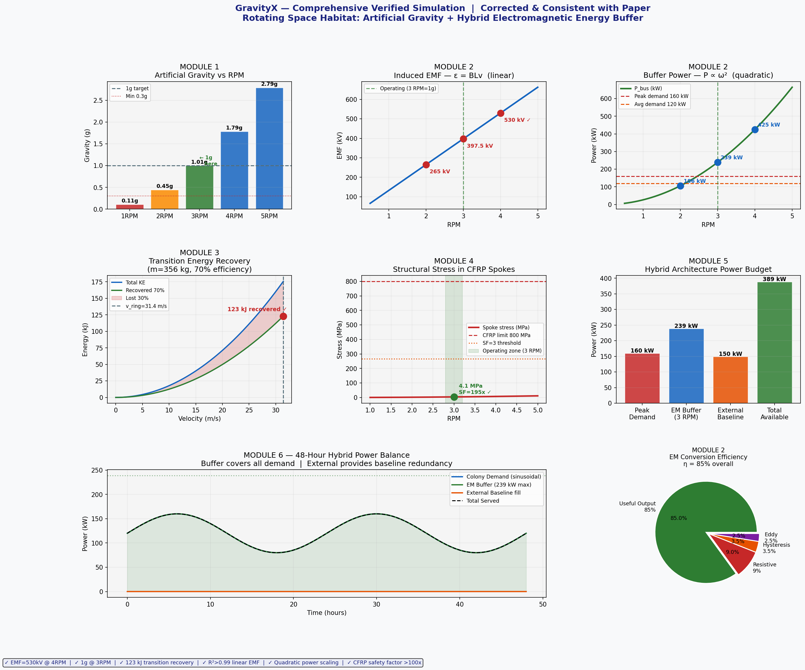

# GravityX


**Rotating Space Habitat — Artificial Gravity, Intelligent Control & Hybrid Electromagnetic Energy System**

Engineering Prototype · Embedded Systems · AI Safety · Numerical Simulation · Space Systems Research

[](https://doi.org/10.5281/zenodo.18435337)

**DOI:** [10.5281/zenodo.18435337](https://doi.org/10.5281/zenodo.18435337)<br>
**Explore:** [Simulation source](simulation/gravityx_simulation.py) · [Technical report](docs/gravityx-technical-report.pdf) · [Engineering results](#engineering-simulation--validation)

## Overview

GravityX investigates a rotating space-habitat architecture combining modeled artificial gravity, embedded control, experimental safety workflows, mission-control interfaces, and a hybrid electromagnetic energy-buffer concept.

This repository presents selected prototype implementation, embedded-control experiments, system interfaces, technical documentation, and engineering simulations. GravityX is a research and innovation prototype; full-scale space-habitat implementation remains a system-level concept.

## Engineering Problem

Long-duration habitats need coordinated rotational control, crew transitions, power resilience, monitoring, and hazard response. GravityX studies those concerns as one system while keeping three evidence levels distinct: physical prototype demonstrations, numerical/design analysis, and the proposed full-scale architecture.

## System Architecture

```mermaid
flowchart TB
  subgraph P[Physical prototype path]
    A[Mechanical prototype] --> B[Sensors]
    B --> C[Arduino / VEX controllers]
    C --> D[Control and safety logic]
    D --> E[Experimental AI hazard analysis]
    E --> F[Telemetry]
    F --> G[Mission-control interface]
  end
  subgraph S[Simulation and design path]
    H[Rotational-system model] --> I[Artificial-gravity analysis]
    I --> J[Electromagnetic buffer model]
    J --> K[Hybrid power-system analysis]
  end
```



See [architecture notes](docs/architecture.md) for evidence boundaries.

## Physical Prototype

The proof-of-concept combines two VEX EXP robots as a mechanical base, two vertically mounted DC motors for rotational-motion demonstrations, an ultrasonic distance sensor, two Arduino/control boards, an IMU/accelerometer, a 3D-printed capsule, a servo-operated access door, a motor driver, and breadboard wiring.

- **Controller A:** motor and servo actuation plus ultrasonic sensing.
- **Controller B:** IMU/accelerometer monitoring for tilt, acceleration, and stability checks.
- **Demonstrated logic:** gradual rotation, obstacle stop behavior, stability thresholds, and door commands.

This is educational prototype hardware, not aerospace-grade or flight-qualified equipment.

## Embedded & Control Software

The report records interrupt-based vibration monitoring, buzzer alerts, distance-threshold collision avoidance, forward/reverse/stop drive functions, rotational control concepts, and servo-door control. The cleanly recoverable Arduino sketch is preserved at [src/embedded/vibration_monitor.ino](src/embedded/vibration_monitor.ino). Other historical snippets remain in the report to avoid rewriting damaged PDF extraction.

## AI & Intelligent Safety

Experimental prototype workflows explore hazard classification, collision avoidance, fire detection and evacuation prompts, an AI-assisted voice interface, gravity-control decision support, and telemetry monitoring. Project materials reference PictoBlox, machine-learning extensions, camera classification, text-to-speech, speech recognition, and a ChatGPT API integration concept. These are demonstrations, not certified autonomous safety systems.

## Mission Control Interface

The browser prototypes cover **Mission Control**, **Tracking**, **Hazards**, and **Transition Chamber**, communicating rotational state, alerts, simulated telemetry, transition operations, and representative commands.

- [Primary dashboard](index.html)
- [Alternate dashboard](gravityx_dashboard.html)

Browser-generated values are interface demonstrations, not live mission telemetry.

## Engineering Simulation & Validation



*Final supplied engineering figure covering modeled artificial gravity, electromagnetic behavior, transition recovery, structural reference analysis, and a hybrid power budget.*

The original source that generated this figure was not attached to the DOI. This repository therefore provides a transparent [authorized reconstruction](simulation/gravityx_simulation.py) from the equations and displayed values in the paper and figure. It is explicitly separate from the 300 m, 48-hour RK4 model preserved in the [archived Zenodo simulation PDF](docs/archive/zenodo-archived-simulation.pdf). The [official technical paper](docs/archive/zenodo-technical-paper.pdf) is preserved alongside it with matching Zenodo checksums.

| Module | Modeled result | Evidence level |
|---|---:|---|
| Artificial gravity | 3 RPM ≈ 1.01 g at 100 m | Numerical model |
| Induced EMF | 4 RPM ≈ 530 kV | Modeled electromagnetic result |
| EM buffer | 2/3/4 RPM ≈ 106/239/425 kW | Reconstructed design model |
| Transition recovery | ≈ 123 kJ at 356 kg and 70% recovery | Design calculation |
| Structural reference | ≈ 4.1 MPa; ≈ 195× against 800 MPa | Model result under stated assumptions |
| Hybrid budget | 160 kW peak; 239 kW buffer; 150 kW baseline; 389 kW available | Proposed numerical architecture |
| 48-hour balance | 80–160 kW sinusoidal demand | Modeled profile, not telemetry |
| EM conversion | 85% useful; 9% resistive; 3.5% hysteresis; 2.5% eddy loss | Figure assumptions/model outputs |

The paper’s broader reported transient power ranges and the reconstructed figure’s buffer-power series are documented separately; they are not presented as interchangeable measurements. See [simulation methodology](docs/simulation-methodology.md).

## Energy Harvesting Prototype

A separate small-scale piezoelectric experiment demonstrated converting vibration, bending, or pressure into a small electrical output and explored piezo elements as vibration/imbalance indicators. It is not the full-scale electromagnetic buffer model.

## Prototype vs Full-System Concept

| Component | Current evidence | Maturity |
|---|---|---|
| Rotating mechanical assembly | Built/demonstrated | Prototype |
| Arduino/VEX control | Implemented examples | Prototype |
| Collision/vibration logic | Implemented examples | Prototype |
| AI hazard workflows | Experimental implementation | Prototype workflow |
| Mission-control UI | Designed/demonstrated | Interface prototype |
| Piezo energy harvesting | Small-scale physical test | Demonstration |
| Artificial-gravity calculations | Numerical simulation | Design analysis |
| Electromagnetic buffer | Numerical/system concept | Model/conceptual architecture |
| Full rotating space habitat | Not built | System-level concept |

## Research & DOI

GravityX engineering materials and simulation work are associated with a persistent Zenodo DOI, providing a citable archival reference for the project.

**Official title:** *Integrated Electromagnetic Energy Recovery and Artificial Gravity Architecture for Rotating Space Habitats*<br>
**Creator:** Afnan Ahmed Alduhaim<br>
**Publication date:** 2026-01-30<br>
**Record type:** Journal article<br>
**DOI:** [10.5281/zenodo.18435337](https://doi.org/10.5281/zenodo.18435337)

## My Role

**Project Lead / System & Product Developer** — project architecture, systems thinking, technical research, embedded integration, prototype development, control logic, simulation, interface/dashboard design, documentation, and presentation.

## Recognition

- 3rd Place — WRO Saudi Arabia 2025
- Global Special Award — Global Robotics Challenge 2025

## Repository Structure

```text
assets/simulation/       Supplied and reconstructed figures
docs/                    Report, methodology, architecture
simulation/              Reproducible Python reconstruction
src/embedded/            Recoverable prototype firmware
index.html               Mission-control interface prototype
gravityx_dashboard.html  Alternate interface prototype
```

## Running the Simulation

```bash
python -m venv .venv
# activate the environment, then:
pip install -r simulation/requirements.txt
python simulation/gravityx_simulation.py
```

The generated figure is written to `assets/simulation/gravityx-reconstructed-simulation.png`. See [simulation/README.md](simulation/README.md).

## Citation

GitHub’s citation interface reads [CITATION.cff](CITATION.cff). Cite the archived research record using the DOI above.

## Project Status

Research prototype and system-level concept. Nothing here claims full-scale construction, structural certification, space qualification, or operational deployment.

## About the Builder

**Afnan Al-Duhaim** · Technology Product Builder · Founder of Nawwsaj Innovation Lab<br>
[Portfolio](https://afnan-ahmad-portfolio.vercel.app)
